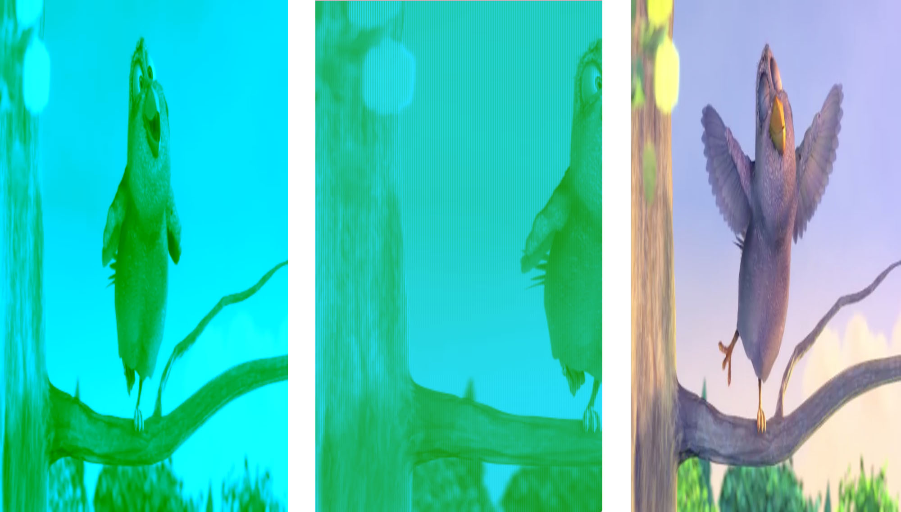

# OpenGL - Swift - Video

A Swift implementation of an openGL View that displays a video

Compile with Xcode 8 beta 2

Current issues:
- Color are wrong (it seems that the V value of YUV color is missing)

Additional issues in the simulator only:
- Only the left half of the video is displayed (over the full screen)
- The image has vertical aberations

### on a device - on the simulator- desired

